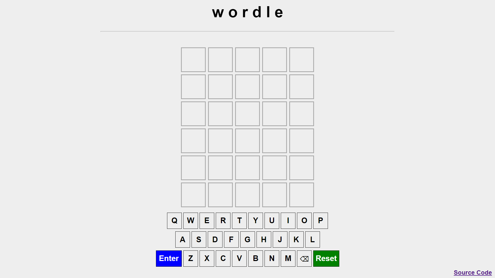
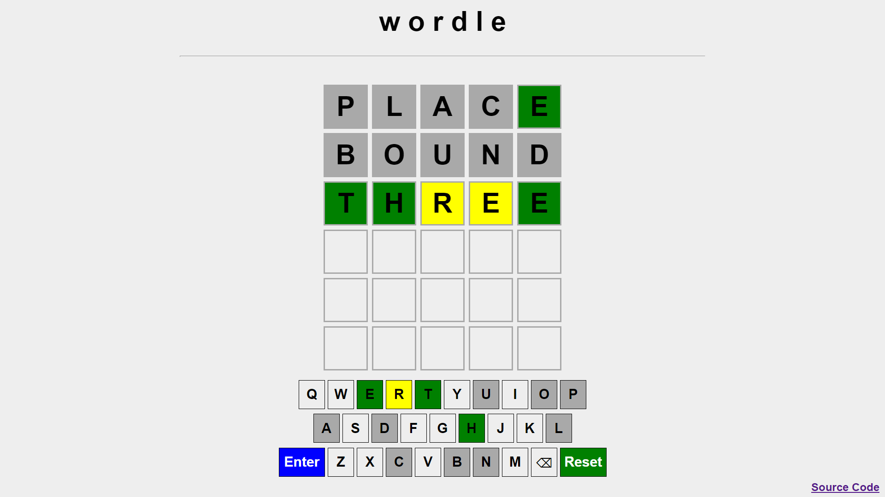
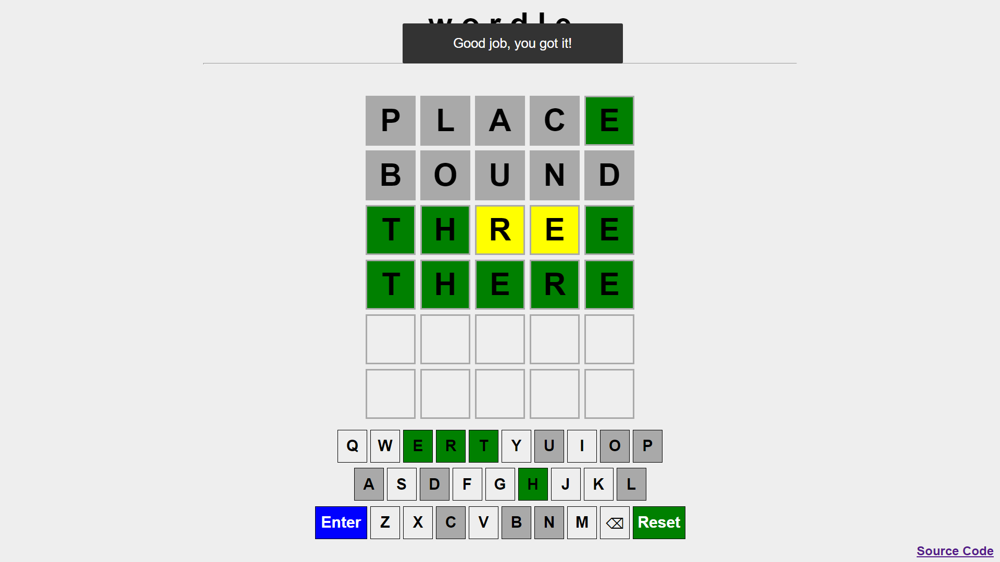
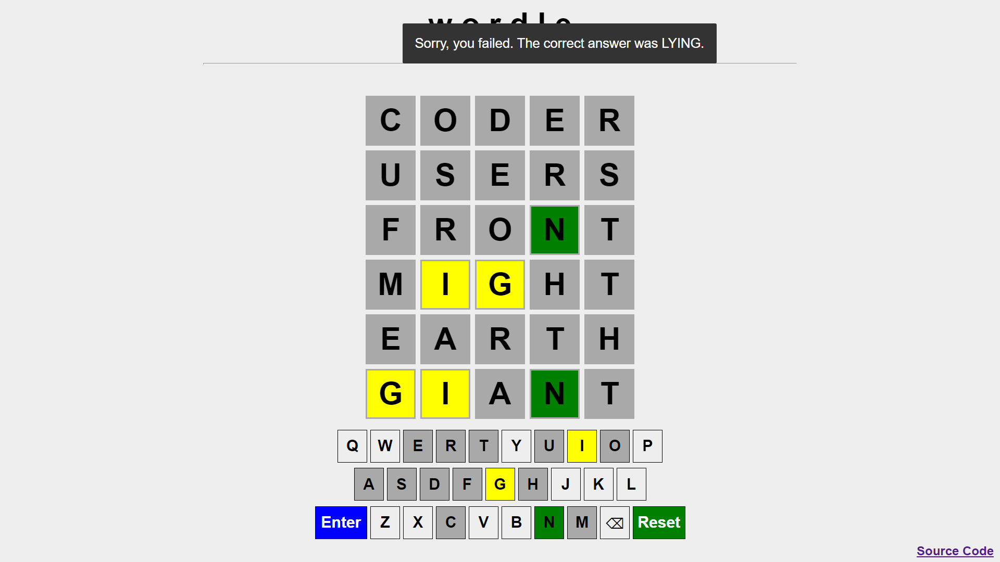

# Wordle Clone

A simple but functional clone of the popular [Wordle](https://en.wikipedia.org/wiki/Wordle) game built in pure HTML, CSS and JavaScript.

## How to Play

Enter a 5-letter word (either by clicking the on-screen keyboard keys or typing on your keyboard). When you have all 5 letters of a valid word in, press (or click on-screen) Enter. Any letters in your guess that are correct turn green, any letters that are incorrect (but the letter is in the word) turn yellow, and any letters that are not in the word are grayed. You have 6 guesses.

You can click the Reset button (or equivalently, just refresh the page) to start a new puzzle.
